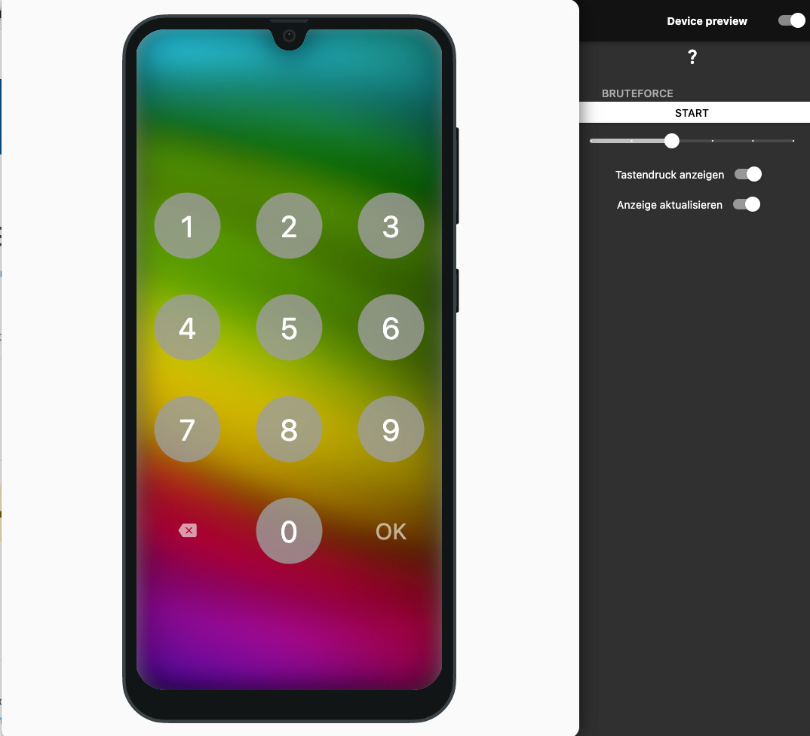

# PasswordCracker

PasswordCracker visualisiere einen Brute-Force-Angriff als anschaulichen Einstieg in die Passwordsicherheit.

PasswordCracker wird als Webanwendung [hier](https://go.schuledigital.com/PasswordCracker) gehostet.

Für eine bessere Performance empfielt es sich (wenn möglich) PasswordCracker als Desktopanwendung zu starten. Über `flutter run --release` kann das Projekt gestartet werden ([Installation von Flutter](https://docs.flutter.dev/get-started/install)).